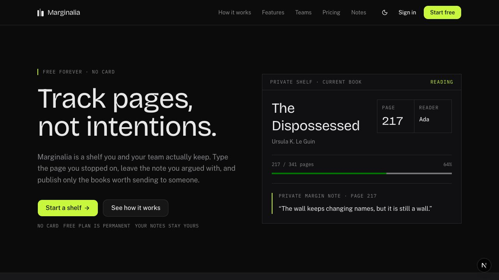

# Operational anti-slop rubric

Use this rubric twice: before implementation to expose an underspecified direction, and
after capture to review the rendered surface. It complements static, browser,
accessibility, overflow, theme, and interaction checks; it does not replace them.

## Review language

- **Pass:** the evidence expresses a deliberate, product-relevant decision.
- **Concern:** the decision may be defensible, but its relationship to the plan is not
  visible; record the rationale or revise it.
- **Blocker:** the surface contradicts the plan, obscures the user's job, omits required
  state or responsive evidence, or ships obvious default/catalog residue.

Do not total or average these outcomes. A polished screenshot can hide a broken journey,
and a numeric aesthetic score would turn judgment into false certainty.

Motifs are evidence only in context. Dark surfaces, pills, cards, gradients, bento
grids, and 3D can all be intentional; none fails by category. Fail a review when the
declared intent or required evidence is absent, stale, contradicted, or unsupported by
the rendered surface. An accepted baseline is a review receipt, not a taste certificate.

## Diagnostic matrix

| Dimension | Observable failure mode | Diagnostic question | Corrective action | Review evidence |
| --- | --- | --- | --- | --- |
| Product specificity | The logo and nouns could be swapped for another SaaS product without changing the page. | Which visual or content decision could exist only for this audience and job? | Replace generic claims and decoration with real domain objects, workflow evidence, or product-shaped imagery. | Name the product-specific element and the user decision it supports. |
| Information hierarchy | Every section has equal visual weight; the page becomes a procession of headline, paragraph, button, and cards. | Can a reader identify the page's promise, proof, and next action in one scan? | Rank content first; change scale, placement, density, and contrast to reflect that rank. Remove sections with no unique job. | Annotate the first, second, and third attention targets at each viewport. |
| Content realism | Placeholder metrics, animated proof values without provenance, generic testimonials, vague benefit copy, or repeated “learn more” labels create false proof. Loading or scramble effects can also expose generated pseudo-text as a semantic heading. | Would this copy survive contact with the product's real data and vocabulary, and does assistive technology receive stable truthful text throughout the effect? | Use approved real copy or clearly synthetic fixtures that exercise realistic lengths, errors, and empty states. Keep the semantic heading stable; hide purely visual pseudo-text from assistive technology. Give changing values a source, stable accessible name, and reduced-motion treatment. | Show the fixture or data source, inspect the rendered accessibility tree during animation, and review the longest, empty, and error cases. |
| Typography | A default primary face, one scale everywhere, or arbitrary weight changes make the page feel unchosen. | What distinct jobs do display, body, label, and mono styles perform? | Choose type roles through the UI system; reduce the scale to a coherent hierarchy and test real line lengths. | Record the type roles and show heading/body hierarchy at narrow and desktop widths. |
| Palette | Untouched neutral tokens, a decorative violet-blue gradient, or accent color on every element removes emphasis. | What does the accent mean, and where is it intentionally absent? | Select a product palette, assign semantic roles, and reserve emphasis for state or priority. | Review light/dark screenshots and contrast results; identify the single dominant accent use. |
| Spacing and density | Uniform generous padding makes unrelated sections float; dense work surfaces use marketing spacing or vice versa. | Where should the experience feel compressed, calm, or fast, and why? | Define a density rhythm by task; group related content more tightly than unrelated content. | Mark group boundaries and compare at least one dense and one spacious region. |
| Shape language | Every container is a rounded card or pill, including items that need no boundary. | What information relationship does each border, radius, or container communicate? | Remove decorative containers; keep surfaces only for grouping, state, affordance, or depth. Use the declared radius system. | Count distinct container purposes, not card count, and justify each exceptional shape. |
| Component-source residue | The output resembles a registry demo; source copy, layout, arbitrary styling, or repeated accent wrappers remain visible. | If the vendor name were hidden, which details would still reveal the catalog demo? | Wrap and retokenize reviewed source, rewrite composition and content for the product, or remove the component. | Record component provenance and the product-specific changes made after review. |
| Assets | Generic stock imagery, random illustration styles, ambiguous 3D, or placeholder icons decorate rather than explain. | What does this asset prove or help the user understand? | Use one coherent asset treatment and product-relevant subject matter; remove assets with no functional or narrative job. | Provide source/license provenance, functional alt text, and the asset's declared role. |
| Responsive re-composition | Desktop columns merely shrink or stack; content order, crop, navigation, and actions are not reconsidered. | What changes in priority and interaction when only 320 CSS pixels are available? | Reorder, collapse, crop, or replace deliberately while preserving information and function. Design the narrow state, do not derive it accidentally. | Compare 320, 768, and 1440 captures and name each structural change. |
| Interaction states | Only the pristine default is designed; loading, empty, error, success, focus, hover, and open states feel like another product. | Which states can interrupt this journey, and does each preserve context and recovery? | Declare every applicable state and meaningful interaction in the plan; style them through the same hierarchy and tokens. | Capture declared states and exercise each meaningful control by accessible name. |
| Accessibility | Low-emphasis copy becomes unreadable, color carries meaning alone, focus disappears, or animation cannot be reduced. | Can the same hierarchy and task survive zoom, keyboard use, reduced motion, and non-color cues? | Repair semantics, contrast, names, labels, focus, alternatives, reflow, and motion preferences before aesthetic refinement. | Attach automated audit results plus keyboard, reflow, and reduced-motion observations. |
| Motion coherence | Many catalog reveals animate independently; motion calls attention to implementation rather than status, causality, or narrative. | What meaning would be lost if this animation were removed, and is the same answer true everywhere it appears? | Keep only motion with a named purpose. Create a small product motion grammar for repeated state changes; remove repeated demo wrappers and ornamental entrances. | List the active motion pieces per viewport, their triggers, meanings, and reduced-motion behavior. |
| Theme intent | Dark mode is an inversion, light mode is an afterthought, or assets and accents work in only one theme. | Does each theme preserve hierarchy, brand character, and state contrast rather than merely pass token substitution? | Tune semantic tokens and assets in context; declare a single-theme surface explicitly when appropriate. | Compare the same route, state, and viewport across every supported theme. |
| Signature element | The page has no memorable idea, or it stacks a bento grid, gradient field, particles, marquee, and 3D scene. | Which one element carries the thesis, and do other accents support or compete with it? | Select one signature element and quiet the surrounding composition. Remove accents that duplicate its job. | Name the signature, its purpose, and every supporting accent retained. |

## Fast failure-pattern scan

Flag these for examination before detailed review; the motif alone is not a failure:

- repeated three-column cards where the content does not require comparison;
- a generic hero plus logo cloud plus bento grid plus testimonial carousel sequence;
- default type, palette, radii, icons, copy, or registry layout;
- badges and pills used as decoration rather than state or metadata;
- gradients, glows, grids, noise, or orbits with no product meaning;
- identical entrance animation on many unrelated blocks;
- claims unsupported by product UI, real content, or an honest fixture;
- animated metrics with no source or stable accessible equivalent;
- generated or scrambled pseudo-text exposed as a semantic heading;
- a narrow page that is simply the desktop DOM stacked vertically;
- controls, menus, forms, or states that were never opened during review.

## Current home diagnosis — 2026-08-09 baseline

Evidence:
[`current-home-before-2026-08-09.png`](../../visual-qa/references/screenshots/current-home-before-2026-08-09.png)
(1280 × 720, desktop, dark). This is a screenshot-level diagnosis; it does not claim
behavior that the image cannot prove.

### What is already specific

- “Track pages, not intentions” is a compact product promise rather than generic
  productivity copy.
- The bookshelf image, marginalia language, serif display voice, mono metadata, and acid
  accent form a recognizable editorial direction.
- The orbiting reading actions attempt to turn the shelf model into a signature element.

### What still reads as generated residue

- The composition uses a familiar dark SaaS hero grammar: slim nav, oversized split
  headline, explanatory paragraph, paired calls to action, faint technical background,
  and a centered orbital diagram. The ingredients are customized, but their hierarchy
  still resembles a catalog hero.
- The product itself is not legible above the fold. A blurred shelf plus abstract icons
  suggests the idea but does not show how a person adds, annotates, or publishes a page.
  The signature therefore carries atmosphere more strongly than proof.
- The eyebrow and footer-like promise line repeat free/no-card messaging while the core
  workflow receives less evidence. Compress that reassurance and spend the recovered
  attention on a real product state.
- Low-emphasis navigation, body, and metadata copy appear visually faint against the
  dark ground. Measure contrast and review on real displays before accepting the
  intended quietness.
- Two dark placeholder shapes in the header read as unresolved controls in the static
  capture. Loading/session placeholders need the same clear footprint and hierarchy as
  the state they replace.
- Only desktop evidence exists here, so the orbit crop, headline wrap, navigation,
  product proof, and action order at narrow and tablet widths remain unverified.

### Static residue found alongside the screenshot review

The deterministic component audit reports four catalog accents stacked in the hero,
three in the closing call to action, and three in the team pulse. Source inspection also
found the same `BlurFade` accent imported by ten blocks. Repetition is not automatically
coherent product motion merely because the wrapper name is consistent. Decide on a
small motion grammar tied to hierarchy or state, centralize it, and remove catalog
entrances that do not carry a distinct meaning.

### Repair direction

Keep the editorial shelf thesis, but make the first viewport prove one concrete loop:
capture a page, annotate it, and decide whether to share it. Let that product evidence
be the single signature element. Reduce duplicated reassurance, generic technical
decoration, and repeated reveal motion; then design and capture the same hierarchy at
320, 768, and 1440 widths before acceptance.

### First repair evidence — 2026-08-09

The repair keeps the product-specific copy, ink/paper system, and acid annotation signal,
but spends the first viewport on a truthful product artifact. The headline no longer
uses generated pseudo-text, proof values no longer begin at zero, and the layout removes
the orbit, technical grid, glow, pill eyebrow, gradient or hatch treatment, and repeated
catalog reveals. These two previews supplement the committed 12-capture light/dark
matrix under `.agents/ui/evidence/`; they do not replace it.

This baseline also disproves a simplistic escape hatch: changing four common
defaults—palette, primary typeface, radius, and violet-blue gradient—does not by itself
remove generated residue. They are diagnostic prompts, not a quantitative claim or a
sufficient definition of quality. Hierarchy, product proof, responsive intent, content
truth, and component or motion residue still require review.

### Oracle-guided living-depth revision — 2026-08-09

The first repair removed catalog residue but overcorrected into a well-typeset
wireframe. Subtraction was necessary, not sufficient: the product still needed one
physical consequence of the reading workflow. The second review selected a
`pulled-book-shelf` direction from three materially different candidates and refined it
into `spine-first-pullout`. Five truthful book spines now control one fixed foreground
book, its page progress, reader, privacy state, and attached note. The finite shelf
plane creates depth only at wider viewports; at 320 pixels it is removed and the same
interaction becomes a flat, readable selector.

The supporting asset has a different job. The credited notebook photograph grounds
the capture-and-annotate loop, while MagicUI Lens appears only on hover or keyboard
focus. It does not autoplay, become a second signature, or hide required information.
The shadcn Tabs structure preserves keyboard selection, the reviewed 21st-derived plane
provides spatial context, and Motion coordinates only the selected book and its note.
Reduced motion renders the final state immediately. Aceternity, ambient grids, 3D
libraries, particles, beams, marquees, and stock bookshelf photography were rejected
because they would add effect count without adding product evidence.

The durable lesson is not “add more 3D.” It is: assign one product-specific object the
page thesis, give every asset a separate explanatory role, and make each vendor
component earn its place through truth, interaction, or spatial understanding. The
complete 12-capture light/dark and 320/768/1440 matrix remains the acceptance record.
