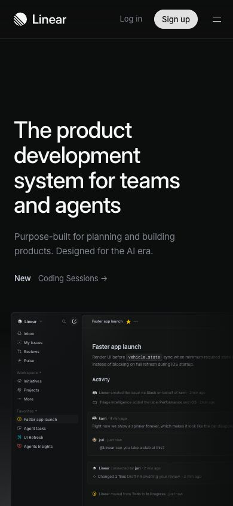
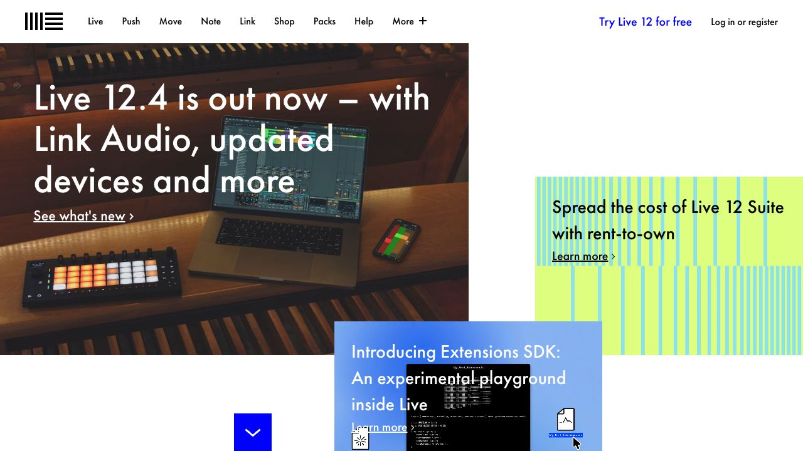
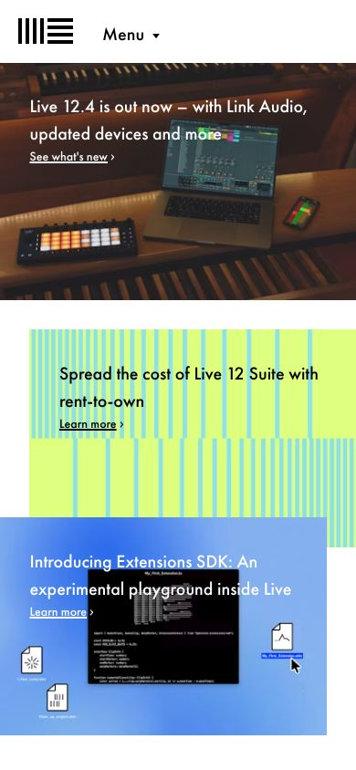
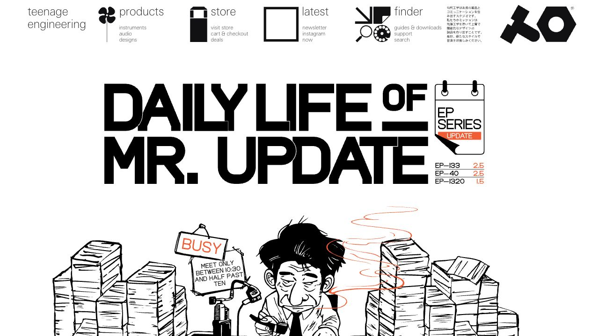
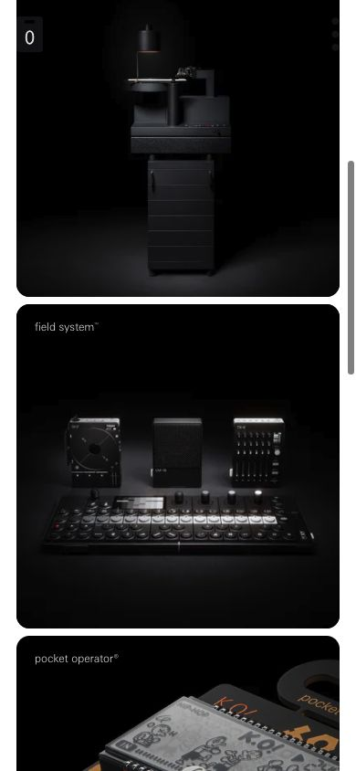

# Attributed real-site reference gallery

Captured 2026-08-09 from public, signed-out home pages. These screenshots are analytical
references stored outside shipping assets. They authorize neither redistribution nor
copying of code, text, brand assets, or complete compositions. Page behavior may have
changed since capture; interaction notes below are limited to what the static image
shows.

## Linear — product-led work system

- **Source:** <https://linear.app/>
- **Pattern:** dark product-led SaaS with direct interface proof.
- **Take:** its disciplined density, concise hierarchy, and early product proof.
- **Avoid:** treating its black palette, exact headline, application chrome, or brand
  mark as the reason the composition works.

### Desktop — 1280 × 720

The headline owns the first scan, secondary copy is deliberately muted, and the product
image acts as proof rather than ornament. Wide empty space separates the promise from a
small timely release link without manufacturing another card.

### Narrow — 390 × 844

Navigation collapses while the two high-value account actions remain visible. The
headline is rewrapped intentionally and product proof stays in sequence instead of
disappearing; its crop shows that narrow evidence must be reviewed, not assumed from
desktop.

## Stripe — infrastructure platform

- **Source:** <https://stripe.com/>
- **Pattern:** category statement, conversion actions, trust proof, and a controlled
  signature color field.
- **Take:** its proof sequence—category statement, action, customer evidence, then
  deeper capability content.
- **Avoid:** copying the spectral gradient, customer logos, financial claims, copy, or
  brand-specific conversion pattern.

### Desktop — 1280 × 720

Typography carries most of the message; the gradient is a single signature backdrop,
not a separate effect on every component. The customer row is visually subordinate to
the value statement while remaining recognizable as evidence.

### Narrow — 390 × 844

The content is reprioritized: navigation yields to the promise and actions, the headline
uses fewer visible clauses, and buttons become full width. The clipped logo row is also
a useful warning—capture the real narrow result and decide whether cropping or overflow
is acceptable rather than inheriting it accidentally.

## Ableton — editorial product-launch system

- **Source:** <https://www.ableton.com/en/>
- **Pattern:** image-led editorial modules for a mature creative product ecosystem.
- **Take:** its editorial rhythm: varied module scale and image treatment express
  priority without wrapping every story in the same card.
- **Avoid:** copying Ableton's exact grid, logo, product imagery, color blocks, copy, or
  overlapping module geometry.

### Desktop — 1280 × 720

The modules share a system but not a template. Scale, image mode, color, and controlled
overlap establish editorial rank. Most of the page remains plain white, giving the
collage enough contrast to be the signature.

### Narrow — 390 × 844

The asymmetric desktop collage becomes a readable vertical narrative. Module identity
survives through crop, color, and overlap rather than through fixed desktop positions;
the order communicates which story leads.

## Teenage Engineering — product catalogue as brand system

- **Source:** <https://teenage.engineering/>
- **Pattern:** experimental hardware retail and editorial identity.
- **Take:** its focus on real objects—product photography and art direction carry the
  interface instead of ornamental UI effects.
- **Avoid:** copying its trade dress: bespoke lettering, illustrations, product
  photography, symbols, navigation grammar, or extreme black-and-white treatment.

### Desktop — 1280 × 720

Navigation, typography, and illustration share one idiosyncratic system. The page is
memorable without cards, gradients, or generic 3D; its risk is learnability, so copying
the unconventional navigation without the brand and audience context would be cargo
cult design.

### Narrow — 390 × 844

The narrow capture changes mode from the desktop editorial announcement to an immersive
product stream. Photography provides continuity and labels stay subordinate. The shift
is a strong example of responsive re-composition, but also demonstrates why routes and
states must be declared: a single desktop screenshot would not predict this experience.

## Cross-reference exercise

Before using this gallery, complete four sentences in the UI plan:

1. “From **[site]**, borrow the decision to **[relationship]** because **[product
   reason]**.”
2. “Do not borrow **[brand-specific surface feature]**.”
3. “At 320 pixels, our hierarchy changes by **[re-composition]**.”
4. “Our one signature element is **[element]**; all other accents support it by
   **[specific role]**.”

If the answers describe colors, gradients, cards, or animations without a product
reason, the reference is still a mood board rather than usable direction.
