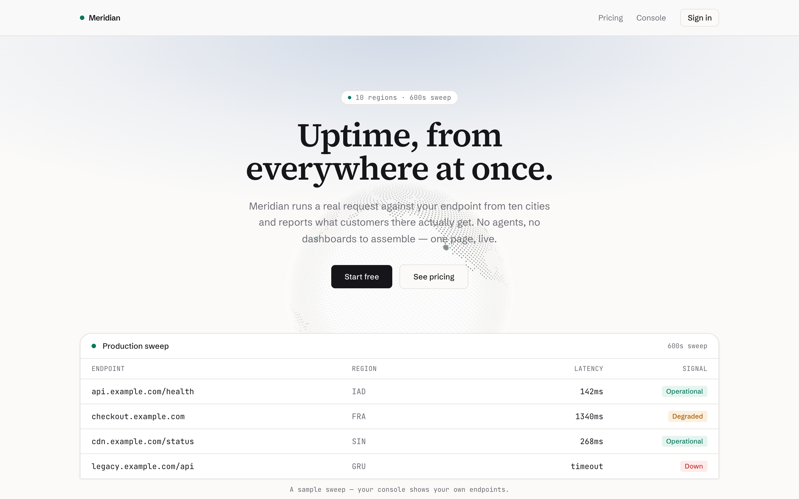
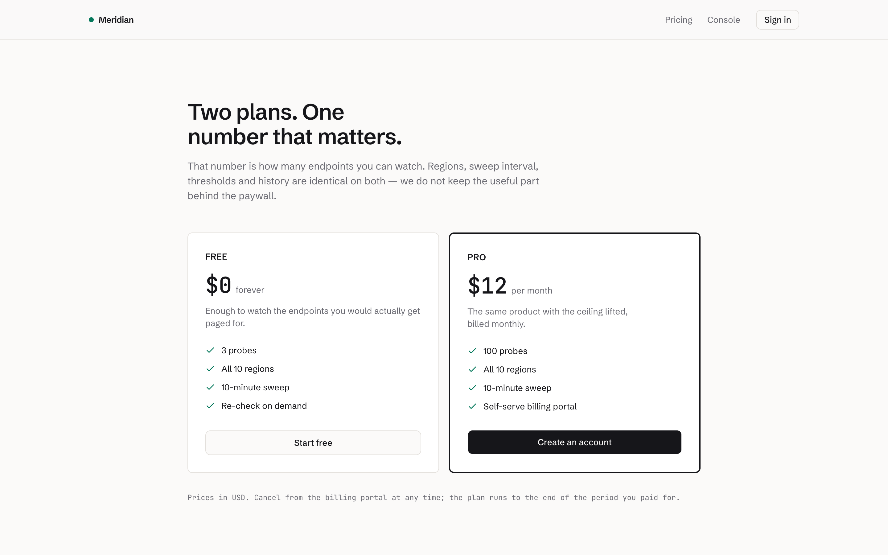
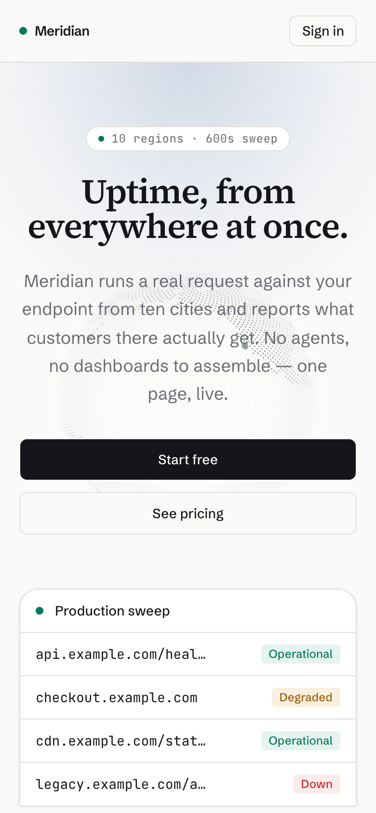

# Agentic Ship

[](https://github.com/moasq/agentic-ship/actions/workflows/ci.yml)
[](https://github.com/moasq/agentic-ship/actions/workflows/plugin-scanner.yml)
[](LICENSE)

<p align="center">
  <picture><source media="(prefers-color-scheme: dark)" srcset=".github/assets/hosts/claude-code-dark.svg"></picture>
  &nbsp;&nbsp;&nbsp;&nbsp;
  <picture><source media="(prefers-color-scheme: dark)" srcset=".github/assets/hosts/codex-dark.svg"></picture>
  &nbsp;&nbsp;&nbsp;&nbsp;
  <picture><source media="(prefers-color-scheme: dark)" srcset=".github/assets/hosts/cursor-dark.svg"></picture>
  &nbsp;&nbsp;&nbsp;&nbsp;
  <picture><source media="(prefers-color-scheme: dark)" srcset=".github/assets/hosts/hermes-dark.svg"></picture>
  &nbsp;&nbsp;&nbsp;&nbsp;
  <picture><source media="(prefers-color-scheme: dark)" srcset=".github/assets/hosts/openclaw-dark.svg"></picture>
</p>

Stop paying for Lovable, Bolt, v0 and Replit. Hosted builders sell the **setup around
the AI** — rules, design and backend conventions, connection and go-live gates. Agentic
Ship is that setup as a toolkit you own and drop into your own workspace, driven by the
coding agent you already pay for. No app is bundled to delete — the kit **directs and
verifies** the one your agent builds.

Agentic Ship is listed in the
[Development & Workflow section of Awesome AI Plugins](https://github.com/hashgraph-online/awesome-ai-plugins#development--workflow).

## Install

Run it from the project directory you want to adopt it in:

```bash
npx github:moasq/agentic-ship
```

Keep the `github:` prefix — it ships from GitHub, not npm. That copies the toolkit into
the current folder (existing files are skipped, never clobbered); then `pnpm install` and
open the folder in your agent. That's it. Say what you want to build; it reads
[AGENTS.md](AGENTS.md) and follows the rules there. Flags: `--force` overwrites,
`--merge` folds the `pnpm` scripts into an existing `package.json`, `--dry-run` previews.

**As a plugin.** In Claude Code or Codex the same repo installs as a plugin — canonical
skills and the pinned MCP catalog, one copy of every rule:

```text
/plugin marketplace add moasq/agentic-ship
/plugin install agentic-ship@agentic-ship
```

**From source**, to develop the toolkit itself:

```bash
git clone https://github.com/moasq/agentic-ship.git
cd agentic-ship && pnpm install && pnpm verify
```

## The agentic development stack

Every layer is chosen, pinned in [skills.lock.json](skills.lock.json), and verified by
gates. The kit's job is making an agent use them correctly together. The full
reasoning behind each pick lives in [docs/stack.md](docs/stack.md).

| Layer | Choice |
| --- | --- |
| Runtime | <picture><source media="(prefers-color-scheme: dark)" srcset=".github/assets/stack/nodedotjs-dark.svg"></picture> <picture><source media="(prefers-color-scheme: dark)" srcset=".github/assets/stack/pnpm-dark.svg"></picture> Node 20+ · pnpm — the only runtime any script assumes |
| Framework | <picture><source media="(prefers-color-scheme: dark)" srcset=".github/assets/stack/nextdotjs-dark.svg"></picture> <picture><source media="(prefers-color-scheme: dark)" srcset=".github/assets/stack/react-dark.svg"></picture> <picture><source media="(prefers-color-scheme: dark)" srcset=".github/assets/stack/typescript-dark.svg"></picture> Next.js 16 · React 19 · TypeScript |
| Styling | <picture><source media="(prefers-color-scheme: dark)" srcset=".github/assets/stack/tailwindcss-dark.svg"></picture> Tailwind v4, CSS-first — tokens in `globals.css`, no config file |
| Components | <picture><source media="(prefers-color-scheme: dark)" srcset=".github/assets/stack/shadcnui-dark.svg"></picture> <picture><source media="(prefers-color-scheme: dark)" srcset=".github/assets/stack/lucide-dark.svg"></picture> shadcn/ui structure · MagicUI motion · Aceternity primitives · 21st.dev sections · Lucide icons |
| State | RSC props first, then URL state, then Zustand 5 |
| Backend | <picture><source media="(prefers-color-scheme: dark)" srcset=".github/assets/stack/convex-dark.svg"></picture> Convex — schema, reactive functions, crons, file storage; functions are the API |
| Auth | <picture><source media="(prefers-color-scheme: dark)" srcset=".github/assets/stack/betterauth-dark.svg"></picture> Better Auth (exact-pinned) through the Convex adapter |
| Billing | <picture><source media="(prefers-color-scheme: dark)" srcset=".github/assets/stack/stripe-dark.svg"></picture> <picture><source media="(prefers-color-scheme: dark)" srcset=".github/assets/stack/polar-dark.svg"></picture> <picture><source media="(prefers-color-scheme: dark)" srcset=".github/assets/stack/lemonsqueezy-dark.svg"></picture> Stripe by default, with Polar and Lemon Squeezy adapters; hosted checkout and webhook-backed entitlement |
| Email | <picture><source media="(prefers-color-scheme: dark)" srcset=".github/assets/stack/resend-dark.svg"></picture> Resend through `@convex-dev/resend` — test-mode by default |
| Analytics | <picture><source media="(prefers-color-scheme: dark)" srcset=".github/assets/stack/posthog-dark.svg"></picture> PostHog behind a first-party `/ingest` proxy; the CSP stays closed |
| Fonts | Self-hosted OFL faces, fetched by `pnpm font`, committed |
| Gates | <picture><source media="(prefers-color-scheme: dark)" srcset=".github/assets/stack/vitest-dark.svg"></picture> Vitest contracts · backend authorization postconditions · Playwright capture · deterministic Node checks — `pnpm verify` on every completion, `pnpm verify:full` before a release |
| UI gates | `pnpm ui:plan` direction contract · `pnpm ui:review` visual evidence · `pnpm check:ui` component boundaries |
| Deploy | <picture><source media="(prefers-color-scheme: dark)" srcset=".github/assets/stack/netlify-dark.svg"></picture> <picture><source media="(prefers-color-scheme: dark)" srcset=".github/assets/stack/vercel-dark.svg"></picture> Netlify by default, with Vercel and Cloudflare Workers adapters; each deploys Convex before the selected frontend |
| Delivery | <picture><source media="(prefers-color-scheme: dark)" srcset=".github/assets/stack/github-dark.svg"></picture> GitHub — `gh` CLI device-flow OAuth for repo, PRs, and CI |
| Tracking | <picture><source media="(prefers-color-scheme: dark)" srcset=".github/assets/stack/github-dark.svg"></picture> GitHub Issues and Projects through `gh`, or <picture><source media="(prefers-color-scheme: dark)" srcset=".github/assets/stack/linear-dark.svg"></picture> Linear through its hosted MCP; both mirror the local queue |
| AI hosts | <picture><source media="(prefers-color-scheme: dark)" srcset=".github/assets/hosts/claude-code-dark.svg"></picture> <picture><source media="(prefers-color-scheme: dark)" srcset=".github/assets/hosts/codex-dark.svg"></picture> <picture><source media="(prefers-color-scheme: dark)" srcset=".github/assets/hosts/cursor-dark.svg"></picture> <picture><source media="(prefers-color-scheme: dark)" srcset=".github/assets/hosts/hermes-dark.svg"></picture> <picture><source media="(prefers-color-scheme: dark)" srcset=".github/assets/hosts/openclaw-dark.svg"></picture> Claude Code · Codex · Cursor · Windsurf · Cline · Copilot · Gemini CLI · Hermes · OpenClaw |
| Tool catalog | 12 pinned MCP servers in [.mcp.json](.mcp.json), including the local Agentic Ship health and queue server, mirrored per host |
| Writing | Vendored docs handbook, humanizer pass, README doctrine, plain-language audit, ADRs — docs are gated prose |

Stack marks are vendored, not hotlinked — provenance in
[.github/assets/stack/credits.md](.github/assets/stack/credits.md). Zustand and
Playwright ship no mark in that set, so their rows stay text-only.

### Run the same gate in GitHub Actions

Downstream repositories can pin this repository as a composite action and run the same
offline `pnpm verify` gate used locally. The action requests only read access, uploads no
artifacts, writes a concise job summary, and keeps the networked supply-chain audit
opt-in. See the [GitHub action guide](.agents/skills/testing/references/github-action.md)
for the pinned workflow example and update procedure.

### Inspect the toolkit through MCP

The project-scoped `agentic-ship` server exposes real health and verification results,
safe connection status, the durable queue, and UI plan and evidence state. Queue
mutations use the same locked transition service as `pnpm agent:work`; they are enabled
only when the server starts with `--allow-mutations`. Read tools validate their output
against tool-specific schemas. Queue reads are bounded and return page metadata, and
connection filters accept only known provider and host IDs. See the
[project MCP guide](.agents/skills/agent-compatibility/references/agentic-ship-mcp.md)
for the tool list, read-only mode, verification, and removal. Claude reads the
canonical declaration directly; the adapter sync carries the same local server into
Codex, Cursor, Hermes, and OpenClaw without changing a user's global host settings.

### Add safe repository maintenance workflows

The root `aw.yml` package includes five opt-in GitHub Agentic Workflows for issue
clarification, CI diagnosis, documentation drift, upstream dependency review, and
release-note drafting across Claude and Codex. Sources are Markdown;
official strict compiler output is committed as `.lock.yml`. The agents have read-only
repository access, deny general network access, and request any comment or review only
through bounded safe outputs. See the
[Agentic Workflows guide](.agents/skills/agent-compatibility/references/github-agentic-workflows.md)
for installation, engine authentication, trial runs, debugging, updates, and removal.

- ✅ **Pinned** — every version, registry, and MCP server locked in [skills.lock.json](skills.lock.json)
- ✅ **Gated** — `pnpm verify` is the definition of done on every completion, not a release ritual
- ✅ **Consent-first** — services connect through the vendor's own OAuth, and every connection is revocable
- ✅ **Offline-first** — a fresh copy verifies green with nothing connected

### Choose a billing provider

Product briefs select one billing provider through `providerSelection.billing`. The deployment repeats that choice in `BILLING_PROVIDER`. Stripe remains the default when the environment variable is absent.

| Provider | Selection | Server integration | Production gate |
| --- | --- | --- | --- |
| [Stripe](.agents/skills/convex-structure/references/stripe-billing.md) | `stripe` (default) | `@convex-dev/stripe` | Requires a live key, webhook secret, price mappings, and `SITE_URL` |
| [Polar](.agents/skills/convex-structure/references/polar-billing.md) | `polar` | `@polar-sh/better-auth` | Requires an access token, webhook secret, product mappings, `SITE_URL`, and `POLAR_SERVER=production` |
| [Lemon Squeezy](.agents/skills/convex-structure/references/lemon-squeezy-billing.md) | `lemonsqueezy` | `@lemonsqueezy/lemonsqueezy.js` | Requires an API key, webhook secret, store and product IDs, variant mappings, `SITE_URL`, and `LEMON_SQUEEZY_MODE=live` |

The shared adapter contract keeps checkout identity server-owned and entitlement webhook-owned. It rejects unsupported selections, configuration from another billing provider, and deployments with multiple active provider secrets. Missing billing credentials remain a warning during development. `pnpm preflight --prod` fails on incomplete or test-mode production configuration.

`pnpm check:backend` makes those authority rules executable once a downstream
`convex/` backend exists. It rejects client-facing entitlement writers, client-supplied
billing identity, unverified webhook paths, a no-op ownership helper, cross-owner reads
or writes without both guards, and writes that run before ownership authorization. The
plain engine reports the check as not applicable because it has no product backend.

Start the selected provider's resumable setup from the project directory:

```bash
pnpm onboard stripe --host codex
pnpm onboard polar --host codex
pnpm onboard lemonsqueezy --host codex
```

### Choose a deployment provider

Product briefs select one deployment provider through `providerSelection.deployment`.
Netlify is the default. Vercel and Cloudflare Workers are supported alternatives. Each
uses the provider's official browser login and keeps backend secrets in Convex. Netlify
and Vercel use an atomic `npx convex deploy --cmd 'pnpm build'` build. Cloudflare uses
the pinned vinext adapter and selects separate production or preview Convex deploy keys
from the Workers Builds branch.

```bash
pnpm onboard netlify --host codex
pnpm onboard vercel --host codex
pnpm onboard cloudflare --host codex
```

Read the [Netlify guide](.agents/skills/convex-structure/references/deploy-netlify.md),
the [Vercel guide](.agents/skills/convex-structure/references/deploy-vercel.md), or the
[Cloudflare Workers guide](.agents/skills/convex-structure/references/deployment-cloudflare.md)
before production. `pnpm preflight` rejects a stale build command or multiple active
deployment adapters. Cloudflare production preflight also requires live proof for the
deployed Worker, custom domain, preview, auth, Convex query, and webhook routes.
`pnpm check:readme` keeps this supported-provider list synchronized with the connection
catalog so a newly wired deployment provider cannot remain in the "not wired" table.

### Not wired yet, and what a swap costs

Opinionated does not mean stuck. Every provider sits behind a seam you own, so the
honest question is not "is it supported" but how much code a swap touches:

| Want instead | Wired today | Swap cost |
| --- | --- | --- |
| Plausible, Umami | PostHog | small — `src/lib/analytics.ts` is the only file that imports the SDK |
| Postmark, SendGrid | Resend | medium — `convex/email.ts` is the only sender, but the Convex component and its webhook go with it |
| Paddle | Stripe, Polar, Lemon Squeezy | medium: add one provider-owned adapter, connection entry, lifecycle fixture, and production check |
| Clerk, Auth.js | Better Auth | medium — session truth is one query behind `requireUser`, but the Convex adapter is load-bearing |
| Supabase, Postgres + Prisma | Convex | large — Convex is the spine; the auth, billing, and email components all ride it. Swapping it means rebuilding those seams |

That last row is this kit's own lock-in, stated plainly. The difference from a hosted
builder: all of it is MIT-licensed code in your repo, so the exit is a refactor you can
run, not an export you buy.

## How it compares

Hosted builders are real products, and the running app they put in a browser tab within
minutes is a real advantage. The table shows what that convenience costs, and what a
toolkit in your own repo does that a rented builder cannot.

Compared against the shipping versions as of August 2026: Lovable with Lovable Cloud
and Build mode, Bolt V2 with Bolt Cloud, the rebuilt v0 platform (February 2026),
Base44 under Wix, and Replit Agent 3. Where they improved, the table says so. Marks
come from each vendor's public docs and product pages; if a cell is wrong or stale,
open an issue — the table only works if it stays true.

✅ yes · ⚠️ partial · ❌ no

| | Agentic Ship | Lovable | Bolt.new | v0 | Base44 | Replit |
| --- | --- | --- | --- | --- | --- | --- |
| Open source | ✅ MIT | ❌ | ❌ | ❌ | ❌ | ❌ |
| Cost | ✅ $0 forever — MIT, drives the agent subscription you already have | ⚠️ free daily credits, then paid credit plans | ⚠️ free monthly tokens, then paid token plans | ⚠️ free monthly credits, then paid plans | ⚠️ free messages, then paid plans; export needs one | ⚠️ free starter credits, then paid credit plans |
| Bring your own coding agent | ✅ any of nine hosts, swap anytime | ❌ built-in agent | ⚠️ pick the model (Claude, GPT, Gemini); the agent is theirs | ❌ built-in agent and model | ❌ built-in agent | ❌ built-in agent |
| Code lives in your git repo | ✅ from the first commit, no platform copy | ✅ two-way GitHub sync | ⚠️ one-way export to GitHub | ✅ native GitHub: branches, PRs, existing repos | ❌ one-way push, on a paid tier | ⚠️ export to GitHub |
| Take everything with you when you leave | ✅ nothing to leave; the repo is the product | ⚠️ code exports; Lovable Cloud Postgres and auth migrate by hand | ⚠️ code exports; Bolt Cloud DB, auth, and hosting are rebuilt elsewhere | ⚠️ standard Next.js exports clean; previews and deploys assume Vercel | ❌ front end exports on a paid tier; the backend stays behind their SDK | ⚠️ code exports; DB, auth, and hosting are Replit services you rebuild |
| Self-host anywhere | ✅ any Node host | ⚠️ after export | ⚠️ after export | ⚠️ after export | ❌ their runtime only | ⚠️ after export |
| Backend built from parts you can hire for | ✅ Convex · Better Auth · Stripe, Polar, or Lemon Squeezy, named and pinned in your repo | ⚠️ Supabase, run by them | ⚠️ Postgres via Bolt Cloud, run by them | ⚠️ your own integrations | ❌ proprietary | ⚠️ Postgres and auth, run by them |
| Definition of done you own | ✅ `pnpm verify` in your repo and CI: contracts, tests, visual evidence | ❌ checks run in their pipeline | ❌ checks run in their pipeline | ❌ checks run in their pipeline | ❌ checks run in their pipeline | ⚠️ Agent 3 self-tests in a real browser — thorough, but in their pipeline |
| Security gates before going live | ✅ dependency audit, closed CSP, production preflight | ✅ auto scan on publish, deep scan on demand | ❌ | ❌ | ❌ | ❌ |
| Enforced design direction per product | ✅ written plan, tokens, review gates | ⚠️ polished house style, no per-product contract | ❌ | ⚠️ strong defaults, one recognizable look | ❌ | ❌ |
| Secrets stay between you and the vendor | ✅ vendor OAuth, hidden terminal input | ⚠️ encrypted, held on their platform | ⚠️ encrypted, held on their platform | ⚠️ encrypted, held on their platform | ⚠️ encrypted, held on their platform | ⚠️ encrypted, held on their platform |
| Zero install, runs in a browser | ❌ needs a terminal | ✅ | ✅ | ✅ | ✅ | ✅ |
| Shareable hosted preview in minutes | ❌ you deploy it | ✅ | ✅ | ✅ | ✅ | ✅ |
| Built for non-developers | ❌ assumes a coding agent | ✅ | ✅ | ✅ | ✅ | ✅ |
| Native mobile output | ❌ web only | ❌ web only | ✅ Expo | ❌ web only | ✅ iOS builds | ⚠️ Expo via templates |

Two fairness notes on cost. The free tiers are real, and fine for a weekend test — but
building a product burns through them, and that is where the paid plans begin. And
hosted credits include the model usage, so a builder is only a second subscription when
an agent subscription already exists — which is exactly who this kit is for. The last
four rows are a real recommendation: if
you will never open a terminal, or you want a phone app from a single prompt, a hosted
builder is the better buy. This kit is for the other case — a coding agent is already
open, and the product has to outlive the demo with owned code, a portable backend, and
a definition of done you can run yourself.

## Built with it

Meridian, an uptime monitor, shipped end to end from this kit: Convex backend, Better
Auth sessions, Stripe plans, Netlify deploy. The kit bundles no UI of its own — every
pixel below was produced by a coding agent working under the kit's rules and gates.

<p align="center">
  
</p>
<p align="center">
  
  &nbsp;
  
</p>

## Works with any agent

Claude Code, Codex (plugins + native adapters), Cursor (generated agents, MCP mirror,
hooks), Hermes (installable profile), and OpenClaw (repo as agent workspace). Windsurf,
Cline, Copilot and Gemini CLI read [AGENTS.md](AGENTS.md) and the plain-markdown skills
directly. One authored rule set, generated adapters per host.

Host marks above are vendored, not hotlinked — provenance in
[.github/assets/hosts/credits.md](.github/assets/hosts/credits.md).

## Documentation

The wiki lives in [docs/](docs/) — one article per question:

- [What is the Agentic Ship stack?](docs/stack.md) — every layer and why it was picked
- [How do I go from empty folder to shipped product?](docs/getting-started.md)
- [How is the toolkit put together?](docs/architecture.md) — one rule, one home
- [How do service connections work?](docs/connections.md) — consent, receipts, revocation
- [How do I see what the agents are doing?](docs/tracking.md) — the work queue, Linear, GitHub
- [How are these docs written?](docs/writing.md) — the writing skills behind the prose

Reference material:

- [AGENTS.md](AGENTS.md) — every rule and every `pnpm` command, in one file
- [.agents/skills/](.agents/skills) — procedures: product lifecycle, connections, UI, backend, security, testing, launch
- [.agents/agents/](.agents/agents) — five specialist role briefs, plus the vendor-generated Playwright trio
- Billing adapters: [Stripe](.agents/skills/convex-structure/references/stripe-billing.md), [Polar](.agents/skills/convex-structure/references/polar-billing.md), and [Lemon Squeezy](.agents/skills/convex-structure/references/lemon-squeezy-billing.md)
- Visual direction — the planning procedure in
  [.agents/skills/visual-direction/SKILL.md](.agents/skills/visual-direction/SKILL.md), its
  [anti-slop rubric](.agents/skills/visual-direction/references/anti-slop-rubric.md),
  [reference sources](.agents/skills/visual-direction/references/sources.md) and
  [real-site gallery](.agents/skills/visual-direction/references/real-site-gallery.md), with
  [.agents/ui/plan.example.json](.agents/ui/plan.example.json) as the worked plan
- Visual review — the acceptance policy in
  [.agents/skills/visual-qa/references/review-policy.md](.agents/skills/visual-qa/references/review-policy.md)

## License

[MIT](LICENSE) — built by [@moasq](https://github.com/moasq).
