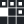
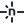

# What is the Agentic Ship stack?

Agentic Ship is a toolkit, not an app: it directs the coding agent you already use to
build a real product on a fixed, verified stack. The stack has three bands. The engine
band is this repository: Node scripts, contracts, and gates. The product band is what
your agent builds with: Next.js on Convex, with a wired seam per vendor (the one
small file where auth, billing, email, or analytics plugs in). The AI band is what
builds it: any of nine coding hosts, eleven pinned MCP servers, five specialist
roles, and five writing skills. This article walks each
layer and says why it was picked; the pins themselves live in
[skills.lock.json](../skills.lock.json).

## The engine band

| Layer | Choice |
| --- | --- |
| Runtime | <picture><source media="(prefers-color-scheme: dark)" srcset="../.github/assets/stack/nodedotjs-dark.svg"></picture> <picture><source media="(prefers-color-scheme: dark)" srcset="../.github/assets/stack/pnpm-dark.svg"></picture> Node 20+ and pnpm, the only runtime any script assumes |
| Gates | <picture><source media="(prefers-color-scheme: dark)" srcset="../.github/assets/stack/vitest-dark.svg"></picture> vitest contract tests, Playwright capture, deterministic Node checks |
| Rules | [AGENTS.md](../AGENTS.md) declarations, skills as procedure |

Everything the kit does is a Node script behind a `pnpm` name, so it behaves the same
on macOS, Linux, and Windows. There is no shell scripting anywhere in the toolkit: a
command that fails silently on one buyer's machine is worse than no command.
`pnpm verify` is the offline definition of done; `pnpm verify:full` adds the
fail-closed dependency audit before anything ships.

## The product band

| Layer | Choice | Why |
| --- | --- | --- |
| Framework | <picture><source media="(prefers-color-scheme: dark)" srcset="../.github/assets/stack/nextdotjs-dark.svg"></picture> <picture><source media="(prefers-color-scheme: dark)" srcset="../.github/assets/stack/react-dark.svg"></picture> <picture><source media="(prefers-color-scheme: dark)" srcset="../.github/assets/stack/typescript-dark.svg"></picture> Next.js 16, React 19, TypeScript | App Router with RSC-first data flow; state lives on the server before it lives anywhere else |
| Styling | <picture><source media="(prefers-color-scheme: dark)" srcset="../.github/assets/stack/tailwindcss-dark.svg"></picture> Tailwind v4, CSS-first | No `tailwind.config.js`; tokens live in one `@theme` block in `globals.css`, and raw hex in a component is a defect the `pnpm check:ui` gate catches |
| Components | <picture><source media="(prefers-color-scheme: dark)" srcset="../.github/assets/stack/shadcnui-dark.svg"></picture> <picture><source media="(prefers-color-scheme: dark)" srcset="../.github/assets/stack/lucide-dark.svg"></picture> shadcn/ui, MagicUI, Aceternity, 21st.dev, Lucide | Structure, motion, primitives, marketing sections, icons: each catalog does one job, discovery runs through pinned MCP servers, and nothing in the path costs money |
| State | RSC props, then URL state, then Zustand | Reaching for a client store first is the classic generated-code smell; the preference order is a declared rule |
| Backend | <picture><source media="(prefers-color-scheme: dark)" srcset="../.github/assets/stack/convex-dark.svg"></picture> Convex | Functions are the API: reactive queries replace cache invalidation, validators are mandatory on both arguments and returns, and identity comes from the authenticated context, never a client argument |
| Auth | <picture><source media="(prefers-color-scheme: dark)" srcset="../.github/assets/stack/betterauth-dark.svg"></picture> Better Auth, exact-pinned | The pin includes the account-takeover fix for GHSA-qq9h-g4jm-xgf3 and is regression-tested against the Convex adapter; only the `upstream-sync` skill moves it |
| Billing | <picture><source media="(prefers-color-scheme: dark)" srcset="../.github/assets/stack/stripe-dark.svg"></picture> Stripe (or Polar) | The browser sends a plan key, never a price or amount; entitlement renders only from the webhook-backed query, never the success redirect |
| Email | <picture><source media="(prefers-color-scheme: dark)" srcset="../.github/assets/stack/resend-dark.svg"></picture> Resend via `@convex-dev/resend` | Ships in test mode so a wrong address in development cannot reach a real person; leaving test mode is a paired, gated flip |
| Analytics | <picture><source media="(prefers-color-scheme: dark)" srcset="../.github/assets/stack/posthog-dark.svg"></picture> PostHog | The one analytics vendor with an official plugin that reads product data back; traffic proxies through `/ingest` on your own origin so the CSP stays closed |
| Fonts | Self-hosted OFL faces | `next/font/google` downloads at build time, which once broke CI on a host with no egress; committed OFL files cannot |
| Deploy | <picture><source media="(prefers-color-scheme: dark)" srcset="../.github/assets/stack/netlify-dark.svg"></picture> Netlify | The whole path is the terminal: `netlify init`, `netlify env:set`, `netlify deploy --prod`; Render was dropped because its first deploy cannot be reached from a terminal at all |
| Delivery | <picture><source media="(prefers-color-scheme: dark)" srcset="../.github/assets/stack/github-dark.svg"></picture> GitHub | Repository, pull requests, and CI through the `gh` CLI's device-flow OAuth; the token lands in the system keyring and is never typed |
| Tracking | <picture><source media="(prefers-color-scheme: dark)" srcset="../.github/assets/stack/linear-dark.svg"></picture> Linear | The hosted Linear MCP mirrors the work queue into a project a person can watch; the queue stays the source of truth |

The brand marks in these tables are vendored, never hotlinked; provenance and the one
edit made to each file are recorded in
[.github/assets/stack/credits.md](../.github/assets/stack/credits.md).

Two rejected alternatives explain the flavor of these picks. Render lost to Netlify
because a deploy that needs a dashboard-minted ID breaks the terminal-only rule.
Amplitude lost to PostHog because its integration is events-first: it can receive data
but gives an agent little to read back.

## The AI band

| Layer | Contents |
| --- | --- |
| Hosts | <picture><source media="(prefers-color-scheme: dark)" srcset="../.github/assets/hosts/claude-code-dark.svg"></picture> <picture><source media="(prefers-color-scheme: dark)" srcset="../.github/assets/hosts/codex-dark.svg"></picture> <picture><source media="(prefers-color-scheme: dark)" srcset="../.github/assets/hosts/cursor-dark.svg"></picture> <picture><source media="(prefers-color-scheme: dark)" srcset="../.github/assets/hosts/hermes-dark.svg"></picture> <picture><source media="(prefers-color-scheme: dark)" srcset="../.github/assets/hosts/openclaw-dark.svg"></picture> Claude Code, Codex, Cursor, Windsurf, Cline, Copilot, Gemini CLI, Hermes, OpenClaw |
| MCP catalog | shadcn, next-devtools, magicui, 21st, context7, convex, stripe, resend, posthog, linear, playwright-test |
| Roles | product-orchestrator, frontend-builder, backend-builder, connection-guide, quality-engineer, plus the vendor-generated Playwright planner, generator, and healer |
| Writing | `writing-guidelines`, `humanizer`, `documentation-and-adrs`, `crafting-effective-readmes`, `plain-language` |

The rules are authored once and generated per host. Claude Code and Codex install the
repo as a plugin. Cursor gets a byte-checked MCP mirror and native agents. Hermes and
OpenClaw get non-secret profiles, and everything else reads
[AGENTS.md](../AGENTS.md) directly. The MCP catalog is pinned in
[.mcp.json](../.mcp.json): the four hosted servers (Stripe, Resend, PostHog, Linear)
authorize through browser OAuth with no key handled, and the rest run as pinned
`npx` executables.

## What holds it together

Three mechanisms keep the bands honest:

- **Gates**: `pnpm verify` runs health, adapter, contract, and UI checks on every
  completion. A change that has not been verified is a change that has not been made.
- **Connections**: every external service joins through a consent-gated, receipt-backed
  handoff that a different host can resume later. See
  [How do service connections work?](connections.md).
- **Provenance**: every vendored skill, pinned server, registry, and declined
  alternative is recorded in [skills.lock.json](../skills.lock.json) with its upstream,
  commit, and license, so the monthly `upstream-sync` pass has something to diff
  against.

The stack is deliberately test-safe by default: Stripe pairs in test mode, Resend only
delivers to its own test inboxes, and seeded rows cannot reach production. Going live
is a set of deliberate flips behind `pnpm preflight`, described in
[How do I go from empty folder to shipped product?](getting-started.md).
